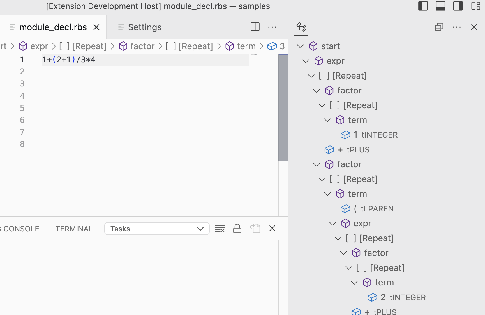

# Parseg

Parseg is a parser generator with support for broken syntax trees.

No parser generation implemented yet. You can use it as a parser combinator for Ruby.

## Set up

Run `bin/setup` to install dependencies.

## Grammar

Grammar is defined in Ruby DSL.

Here is an example that parses a mathematical expression.

```ruby
tokenizer = Parseg::StrscanTokenizer.new(
    {
        tPLUS: /\+/,
        tMINUS: /\-/,
        tSTAR: /\*/,
        tSLASH: /\//,
        tLPAREN: /\(/,
        tRPAREN: /\)/,
        tINTEGER: /\d+/
    },
    /\s+/   # Skips spaces
)

grammar = Parseg::Grammar.new do |grammar|
  grammar[:start].rule = NT(:expr)

  # expr ::= factor (`*` | `/`) ... (`*` | `/`) factor
  grammar[:expr].rule = Repeat(NT(:factor), Alt(T(:tSLASH), T(:tSTAR)))

  # factor ::= term (`+` | `-`) ... (`+` | `-`) term
  grammar[:factor].rule = Repeat(NT(:term), Alt(T(:tPLUS), T(:tMINUS)))

  # term ::= `(` expr `)`
  #        | tINTEGER
  grammar[:term].rule = Alt(
    T(:tLPAREN) + NT(:expr) + T(:tRPAREN),
    T(tINTEGER)
  )
end

# Returns a pair of tokenizer and grammar
[tokenizer, grammar]
```

See the `grammar.rbs` for the details of the DSL.

## Usage

You can use `bin/parse` command to test your grammar.

```
$ bundle exec bin/parse samples/math.rb
1+2
[Ctrl-D]
[{:expr=>[{:factor=>[{:term=>[[:tINTEGER, "1"]]}]}, [:tPLUS, "+"], {:factor=>[{:term=>[[:tINTEGER, "2"]]}]}]}]  # <= Parsing result
```

It comes with error tolerant mode by default.
If your input has syntax error, it will print some syntax tree with error trees.

```
$ bundle exec bin/parse samples/math.rb
1+2+
[Ctrl-D]
[{:start=>[{:expr=>[{:factor=>[{:term=>[[:tINTEGER, "1"]]}]}, [:tPLUS, "+"], {:factor=>[{:term=>[[:tINTEGER, "2"]]}]}, [:tPLUS, "+"], {:unexpected=>nil}]}]}]
```

The `{ unexpected => nil }` at the end of the output is an error tree that means another token is expected but `EOF` comes.

You can test with a vscode extension in the `vscode-extension` directory interactively.

1. Open vscode-extension directory and hit `F5` to start another vscode session with the extension.
2. Goto workspace settings and configure `Parseg-lsp/Grammar`. Fill `math.rb` for example.
3. Open command palette and `Start Parseg LSP demo`.
4. Type something and the parsing results displayed in the outline tab.
5. You can try different configurations in settings, and restart it with `Start Parseg LSP demo`.



## Development

After checking out the repo, run `bin/setup` to install dependencies. Then, run `rake test` to run the tests. You can also run `bin/console` for an interactive prompt that will allow you to experiment.

To install this gem onto your local machine, run `bundle exec rake install`. To release a new version, update the version number in `version.rb`, and then run `bundle exec rake release`, which will create a git tag for the version, push git commits and the created tag, and push the `.gem` file to [rubygems.org](https://rubygems.org).

## Contributing

Bug reports and pull requests are welcome on GitHub at https://github.com/soutaro/parseg. This project is intended to be a safe, welcoming space for collaboration, and contributors are expected to adhere to the [code of conduct](https://github.com/soutaro/parseg/blob/master/CODE_OF_CONDUCT.md).

## License

The gem is available as open source under the terms of the [MIT License](https://opensource.org/licenses/MIT).

## Code of Conduct

Everyone interacting in the Parseg project's codebases, issue trackers, chat rooms and mailing lists is expected to follow the [code of conduct](https://github.com/soutaro/parseg/blob/master/CODE_OF_CONDUCT.md).
